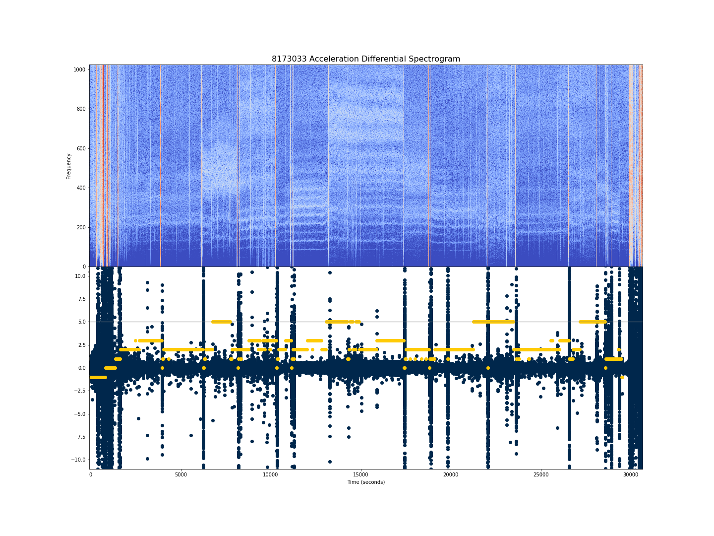

# Machine learning models based on sleep_classifiers
#### *Extending Olivia Walch's (@ojwalch) <a href="https://github.com/ojwalch/sleep_classifiers">sleep_classifiers</a> using neural networks.*
---

If you're looking for Jupyter Notebooks containing the ML models, check out the <code>notebooks</code> folder. If you're interested in ETL/feature extraction and engineering, look at <code>source/etl.py</code>. Methods for training and evaluating our models are in <code>source/evaluator.py</code>. These generally assume you have already extracted the data from Dr. Walch's study into the <code>data</code> folder of the project root directory (directory where this <code>README</code> lives). 

**Project Overview:** Olivia and I use <a href="https://musiclab.chromeexperiments.com/Spectrogram/">spectrograms</a> derived from triaxial accelerometer data, from the aforementioned <code>sleep_classifiers</code>, as training data for several machine learning techniques with the goal of predicting sleep stages. After our initial focus on accurate prediction of Awake/Asleep, we are extending our techniques to three and four sleep stage prediction. 

Our best results came from convolutional neural networks incorporating a time feature after their convolutional layers. For comparison, we also explored pure feedforward neural networks (with and without the time feature), along with some logistic regression models; see the <code>notebooks</code> folder. 

---

## Spectrograms? 
Spectrograms are used to study the frequencies correlated most strongly with a signal over time via short-time Fourier transforms (STFTs): taking Fourier transforms of the signal in a progressive temporal window. When plotted with time on the horizontal axis and frequency on the vertical axis, we visualize these Fourier transform windows as spectrograms. We used SciPy's <code>signal.stft</code> to create our spectrograms from the triaxial accelerometer data. These are input as black-and-white images to the neural networks.  

To give some idea for the information contained in these, below is a spectrogram (top) generated using Python's Librosa library, along with the derivative of acceleration (in blue) and PSG labels (in maize) on the bottom.  The highest PSG label of 5 corresonds to REM sleep; awake is class 0; NREM stages are classes 1, 2, 3, 4.
  
